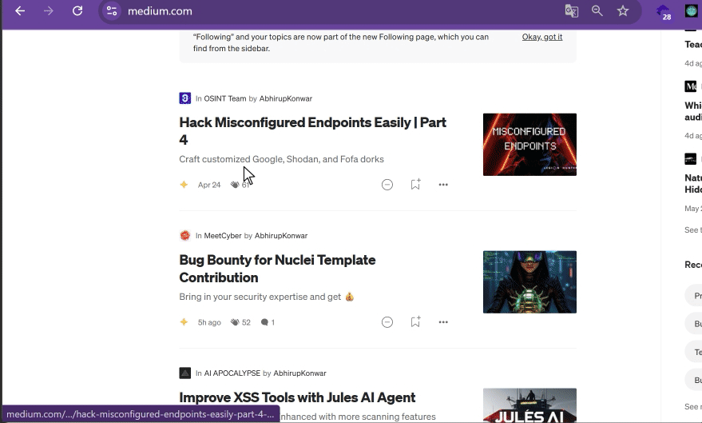

Auto Freedium Redirect for Medium (0-Interaction)
=================================

Chrome extension (Manifest V3) that automatically redirects Medium "Member-only story" articles to `https://freedium.cfd/<full-original-url>` on whitelisted domains.

Demo
----

Whitelisted domains
-------------------
- medium.com and subdomains
- infosecwriteups.com

How to install (developer mode)
--------------------------------
1. Open Chrome at `chrome://extensions/`.
2. Enable Developer Mode (top-right).
3. Click "Load unpacked" and select this project folder.

Settings UI
-----------
Click the extension icon in the toolbar to open the settings popup where you can:
- View current whitelisted domains
- Add new domains to the whitelist
- Remove domains from the whitelist
- Settings are automatically saved and synced across devices

How it works
------------
- A content script observes the DOM (including SPA dynamic loads) and looks for the text "Member-only story".
- When detected, it redirects once to `https://freedium.cfd/<full-original-url>` using `location.replace` and adds the `?freedium-redirected=1` flag to the original URL to avoid loops.

Notes
-----
- The script only runs on whitelisted domains declared in `manifest.json`.
- It does not collect data or modify content, it only redirects when necessary.

